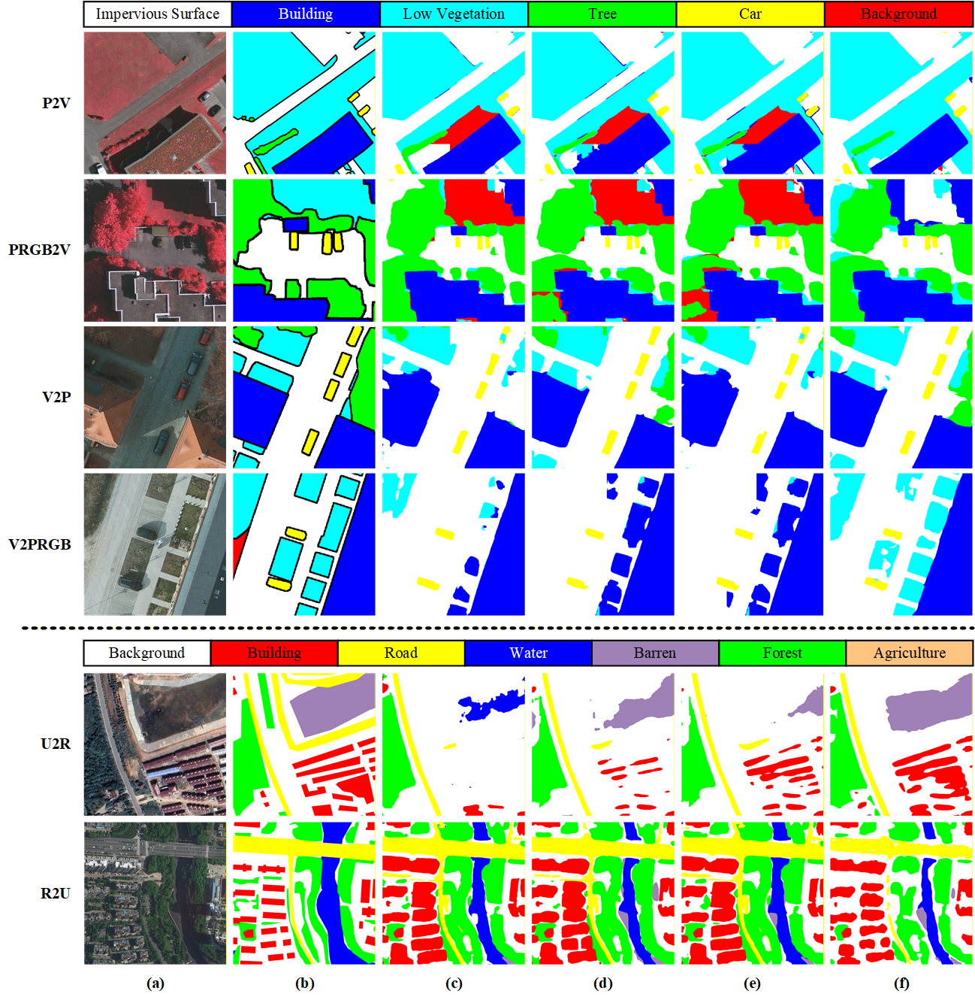

# Submission to TGRS 2026：Boosting Domain Generalization in Remote Sensing Image Segmentation by Large-scale Style Simulation and Multi-scale Model Fine-Tuning


## Abstract👓

Domain Generalization (DG) for remote sensing image (RSI) segmentation is a challenging yet crucial task, as it enables models to generalize to unseen target domains without accessing target data during training. Most existing DG methods have achieved promising results through Data Manipulation (DM) and Model Optimization (MO), however, the existing methods suffer from two limitations. First of all, existing DM strategies are typically constrained by limited source-domain diversity and cannot sufficiently approximate the complex style variations in unseen scenarios. Secondly, existing MO methods cannot effectively learn domain-invariant and multi-scale representations due to insufficient model capacity. To address the above problems, a Style-guided Semantic-embedding Enhanced (SSE) framework is proposed, improving generalization through large-scale style simulation and multi-scale Vision Foundation Models (VFMs) fine-tuning. Specifically, to expand the coverage of the training data distribution, a Grid-based Fourier Style Transfer (GFST) module is proposed. It leverages Fast Fourier Transform (FFT) to extract amplitudes from a million-scale remote sensing dataset and performs patch-wise style transfer for each source image, enabling the stylized source images to yield diverse style variations while preserving structural semantics. Furthermore, to facilitate domain-invariant and scale-aware representation learning, a Semantic Embedding Fine-Tuning (SEFT) module is proposed. It embeds multi-scale semantic tokens between every two frozen layers of the VFM, enabling adaptive multi-scale representation refinement. Theoretical analysis indicates that SSE reduces the domain generalization error bound by jointly enlarging the attainable source distribution space and boosting feature discriminability. Extensive experiments show that SSE outperforms previous methods, with improvements of at least 2.2\% on the ISPRS dataset and 1.2\% on the LoveDA dataset, respectively. These results validate the effectiveness and robustness of SSE across diverse cross-domain remote sensing scenarios. The code is released at https://github.com/fangyiwei98/SSE.


## Highlight✨

- We propose a novel Style-guided Semantic-embedding Enhanced (SSE) framework, which improves domain generalization performance in RSI segmentation through large-scale style simulation and multi-scale VFM fine-tuning.
- We propose a Grid-based Fourier Style Transfer (GFST) module to achieve diverse and representative training data. It leverages a million-scale remote sensing dataset to construct a style bank and performs patch-wise style transfer to emulate style variants.
- We propose a Semantic Embedding Fine-Tuning (SEFT) module to improve domain-invariant representation learning. It embeds multi-scale semantic information into the VFM, empowering the VFM to effectively capture multi-scale remote sensing representations.
- We provide the theoretical analysis to prove that SSE effectively reduces the domain generalization error bound by improving the diversity of training data and the discriminability of representations. Extensive experimental results show that SSE significantly outperforms state-of-the-art methods.


## Method Overview💡


## Visualization👀
### Ablation visualization on the ISPRS and LoveDA datasets. 


### t-SNE visualization of feature representations on LoveDA dataset.


## Usage🧠

### Datasets ###
All datasets including [ISPRS](https://www.isprs.org/education/benchmarks/UrbanSemLab/2d-sem-label-potsdam.aspx) dataset and [LoveDA](https://github.com/Junjue-Wang/LoveDA) dataset.

### Environment Setup
To set up your environment, execute the following commands:
```bash
conda create -n rein -y
conda activate rein
conda install pytorch==2.0.1 torchvision==0.15.2 torchaudio==2.0.2 pytorch-cuda=11.7 -c pytorch -c nvidia -y
pip install -U openmim
mim install mmengine
mim install "mmcv>=2.0.0"
pip install "mmsegmentation>=1.0.0"
pip install "mmdet>=3.0.0"
pip install xformers=='0.0.20' # optional for DINOv2
pip install -r requirements.txt
pip install future tensorboard
```

### Pretraining Weights
* **Download:** Download pre-trained weights from [facebookresearch](https://dl.fbaipublicfiles.com/dinov2/dinov2_vitl14/dinov2_vitl14_pretrain.pth) for testing. Place them in the project directory without changing the file name.
* **Convert:** Convert pre-trained weights for training or evaluation.
  ```bash
  python tools/convert_models/convert_dinov2.py checkpoints/dinov2_vitl14_pretrain.pth checkpoints/dinov2_converted.pth
  ```
  (optional for 1024x1024 resolution)
  ```bash
  python tools/convert_models/convert_dinov2.py checkpoints/dinov2_vitl14_pretrain.pth checkpoints/dinov2_converted_1024x1024.pth --height 1024 --width 1024
  ```
  

### Training
```
CUDA_VISIBLE_DEVICES=1 nohup python -u tools/train.py > train.log 2>&1 &
```


## Results ##

### Results on the ISPRS dataset


| Method | Domain | Surf | Bldg | Vegt | Tree | Car | Bkgd | mIoU (%) | Domain | Surf | Bldg | Vegt | Tree | Car | Bkgd | mIoU (%) |
|--------|--------|------|------|------|------|-----|------|----------|--------|------|------|------|------|-----|------|----------|
| **DG** |  |  |  |  |  |  |  |  |  |  |  |  |  |  |  |  |
| DAFormer | P2V | 73.8 | 82.9 | 46.1 | 70.0 | 45.9 | 8.0 | 54.4 | PRGB2V | 64.2 | 73.4 | 4.5 | 9.7 | 42.2 | 1.5 | 32.6 |
| HRDA | P2V | 75.0 | 78.3 | 43.3 | 68.3 | 50.8 | 12.8 | 54.7 | PRGB2V | 67.1 | 66.9 | 4.1 | 17.5 | 43.0 | 1.8 | 33.4 |
| MTP | P2V | 75.0 | 84.5 | 51.7 | 70.8 | 65.5 | 25.3 | 62.6 | PRGB2V | 51.0 | 64.8 | 4.4 | 7.5 | 56.8 | 1.9 | 31.1 |
| Rein | P2V | 79.4 | 90.4 | 54.0 | 71.5 | 53.6 | 13.0 | 60.3 | PRGB2V | 79.1 | 91.2 | 37.0 | 62.2 | 61.1 | 5.7 | 56.1 |
| CrossEarth | P2V | 83.6 | 91.7 | <u>63.8</u> | 70.2 | 59.5 | **36.3** | 67.5 | PRGB2V | 78.1 | 89.3 | <u>55.2</u> | 72.5 | 61.9 | <u>14.5</u> | 61.9 |
| CDG | P2V | <u>83.8</u> | **93.2** | 62.9 | **78.6** | **72.7** | 17.3 | <u>68.1</u> | PRGB2V | <u>82.5</u> | **92.4** | 45.2 | **79.4** | **71.0** | 6.9 | <u>62.9</u> |
| SSE | P2V | **84.6** | <u>93.0</u> | **67.2** | <u>77.7</u> | <u>70.1</u> | <u>29.0</u> | **70.3** | PRGB2V | **82.9** | <u>91.5</u> | **61.4** | <u>79.2</u> | <u>70.7</u> | **23.0** | **68.1** |
| DAForme | V2P | 64.2 | 66.5 | 54.1 | 28.2 | 66.6 | 6.0 | 47.6 | V2PRGB | 46.0 | 59.4 | 12.6 | 5.8 | 63.5 | 2.9 | 31.7 |
| HRDA | V2P | 69.2 | 70.1 | 55.6 | 38.9 | 75.6 | <u>10.6</u> | 53.3 | V2PRGB | 54.7 | 54.7 | 11.6 | 14.4 | 72.3 | 6.5 | 35.7 |
| MTP | V2P | 70.3 | 76.9 | 50.2 | 8.2 | 82.5 | 1.9 | 48.3 | V2PRGB | 58.5 | 76.5 | 44.4 | 10.8 | 82.0 | 1.4 | 48.6 |
| Rein | V2P | 75.9 | <u>86.5</u> | 60.6 | 37.9 | 80.6 | 4.3 | 57.6 | V2PRGB | <u>70.4</u> | 77.4 | <u>58.6</u> | 13.9 | 78.5 | 4.4 | 50.6 |
| CrossEarth | V2P | **77.1** | 80.8 | 61.3 | 38.9 | 82.9 | 8.4 | 58.2 | V2PRGB | **72.5** | 73.6 | **58.7** | 22.4 | 81.1 | 7.6 | <u>52.7</u> |
| CDG | V2P | 73.1 | 85.9 | <u>62.2</u> | <u>41.4</u> | <u>83.7</u> | 10.0 | <u>59.4</u> | V2PRGB | 63.2 | <u>78.9</u> | 49.8 | <u>30.1</u> | <u>82.3</u> | <u>10.5</u> | 52.4 |
| SSE | V2P | <u>76.6</u> | **88.5** | **63.8** | **43.6** | **84.6** | **20.6** | **63.0** | V2PRGB | 68.8 | **84.2** | 56.0 | **31.6** | **82.7** | **24.6** | **60.5** |
| **UDA** |  |  |  |  |  |  |  |  |  |  |  |  |  |  |  |  |
| MCD | P2V | 55.2 | 64.4 | 25.3 | 61.9 | 39.9 | 11.9 | 43.1 | PRGB2V | 50.1 | 60.2 | 27.4 | 54.9 | 29.7 | 5.3 | 37.9 |
| CLAN | P2V | 51.8 | 60.2 | 33.7 | 61.0 | 35.4 | 19.6 | 43.6 | PRGB2V | 49.0 | 57.6 | 26.8 | 70.1 | 27.4 | 3.3 | 36.3 |
| CCDA | P2V | 48.2 | 76.8 | 47.0 | 55.0 | 44.9 | 20.7 | 52.0 | PRGB2V | 57.7 | 65.4 | 29.8 | 35.9 | 57.0 | 13.3 | 43.2 |
| CycleGAN | P2V | 50.2 | 61.2 | 22.2 | 59.0 | 20.5 | 8.6 | 36.5 | PRGB2V | 46.2 | 65.4 | 27.9 | 55.8 | 40.3 | 3.9 | 39.9 |
| DiGA | P2V | 49.4 | 62.3 | 38.9 | 57.7 | 34.3 | 29.7 | 45.4 | PRGB2V | 51.3 | 78.2 | 31.5 | 57.8 | 48.6 | 9.1 | 46.9 |
| ProDA | P2V | 55.3 | 68.7 | 32.5 | 61.0 | 42.0 | 8.2 | 44.6 | PRGB2V | 49.8 | 50.5 | 14.9 | 58.5 | 36.9 | 22.5 | 38.9 |
| MASN | P2V | 60.3 | 69.6 | 44.6 | 61.2 | 50.1 | 21.2 | 50.1 | PRGB2V | 65.2 | 83.4 | 51.6 | 33.4 | 43.5 | 25.4 | 48.9 |
| CaGAN | P2V | 59.4 | 66.6 | 42.4 | 63.8 | 49.4 | 25.9 | 51.3 | PRGB2V | 62.2 | 70.4 | 31.5 | 55.5 | 47.3 | 11.6 | 45.4 |
| RCA-DD | P2V | 59.5 | 65.7 | 43.8 | 61.3 | 48.1 | 22.9 | 50.2 | PRGB2V | 46.4 | 68.5 | 32.8 | 58.1 | 49.3 | 10.6 | 44.3 |
| NAPG | P2V | 65.3 | 82.3 | 47.4 | 62.3 | 28.4 | 30.4 | 52.3 | PRGB2V | 61.3 | 75.2 | 43.9 | 58.6 | 27.3 | 28.3 | 49.3 |
| MCD | V2P | 37.2 | 54.3 | 33.0 | 39.4 | 48.3 | 3.1 | 35.4 | V2PRGB | 39.6 | 54.6 | 30.2 | 41.5 | 49.3 | 3.8 | 36.5 |
| CLAN | V2P | 34.0 | 59.9 | 35.3 | 37.7 | 44.9 | 4.6 | 35.3 | V2PRGB | 55.2 | 43.5 | 43.1 | 24.0 | 58.0 | 2.9 | 37.3 |
| CCDA | V2P | 57.7 | 65.4 | 29.8 | 35.9 | 57.0 | 13.3 | 43.2 | V2PRGB | 64.4 | 66.4 | 47.2 | 37.6 | 59.4 | 12.3 | 46.9 |
| CycleGAN | V2P | 46.0 | 59.0 | 41.7 | 25.8 | 39.7 | 13.6 | 37.6 | V2PRGB | 51.0 | 53.4 | 36.5 | 35.0 | 48.5 | 11.5 | 39.3 |
| DiGA | V2P | 60.4 | 64.9 | 9.5 | 48.4 | 76.1 | 4.7 | 44.0 | V2PRGB | 58.4 | 68.1 | 54.9 | 53.2 | 40.3 | 2.3 | 45.9 |
| ProDA | V2P | 35.9 | 57.6 | 38.8 | 42.6 | 43.3 | 0.9 | 36.5 | V2PRGB | 32.9 | 63.0 | 33.9 | 41.0 | 55.3 | 0.4 | 37.8 |
| MASN | V2P | 51.5 | 77.5 | 31.2 | 55.4 | 48.7 | 11.0 | 42.1 | V2PRGB | 61.7 | 69.5 | 43.3 | 60.2 | 44.8 | 17.7 | 49.1 |
| CaGAN | V2P | 49.0 | 64.8 | 38.4 | 43.5 | 45.8 | 3.0 | 40.7 | V2PRGB | 62.5 | 65.8 | 49.6 | 33.2 | 67.1 | 1.1 | 46.6 |
| RCA-DD | V2P | 44.1 | 57.3 | 36.8 | 41.8 | 57.2 | 3.0 | 40.0 | V2PRGB | 60.4 | 64.0 | 49.0 | 38.6 | 66.0 | 0.2 | 46.4 |
| NAPG | V2P | 49.7 | 68.0 | 49.3 | 48.6 | 42.9 | 13.4 | 44.7 | V2PRGB | 54.4 | 67.3 | 53.5 | 51.6 | 42.4 | 31.7 | 49.3 |


### Results on the LoveDA dataset


| Method | Domain | Bkgd | Bldg | Rd | Wtr | Barr | Frst | Agri | mIoU (%) | Domain | Bkgd | Bldg | Rd | Wtr | Barr | Frst | Agri | mIoU (%) |
|--------|--------|------|------|----|-----|------|------|------|----------|--------|------|------|----|-----|------|------|------|----------|
| **DG** |  |  |  |  |  |  |  |  |  |  |  |  |  |  |  |  |  |  |
| DAFormer | U2R | <u>57.1</u> | 46.9 | 36.5 | 62.9 | <u>12.1</u> | 18.5 | 51.3 | 40.8 | R2U | 40.1 | 55.2 | 51.7 | 69.9 | 43.3 | 51.9 | 49.0 | 51.6 |
| HRDA | U2R | 50.2 | 46.1 | 40.0 | 66.6 | 6.8 | <u>26.9</u> | 58.1 | 42.1 | R2U | <u>41.6</u> | 57.1 | 53.1 | 63.2 | 45.6 | 51.8 | 56.0 | 52.6 |
| MTP | U2R | 55.5 | 44.4 | 46.3 | 66.7 | 7.3 | **37.0** | 50.7 | 44.0 | R2U | 40.8 | 59.6 | <u>58.3</u> | 74.4 | 46.6 | 47.4 | 54.6 | 54.5 |
| Rein | U2R | 57.0 | 56.3 | **49.4** | <u>68.2</u> | 9.3 | 25.5 | 53.5 | 45.6 | R2U | 40.3 | <u>64.0</u> | 56.6 | **76.0** | <u>50.4</u> | <u>55.4</u> | <u>61.1</u> | 57.7 |
| CrossEarth | U2R | **57.5** | 61.5 | 48.5 | 65.6 | 9.6 | 25.4 | 58.2 | <u>46.6</u> | R2U | 39.8 | 63.3 | 57.3 | <u>75.9</u> | **51.8** | 55.0 | **62.5** | <u>57.9</u> |
| CDG | U2R | 56.0 | **65.0** | 39.8 | **71.0** | **15.2** | 10.7 | **64.8** | 46.1 | R2U | 41.2 | 62.3 | <u>58.3</u> | 74.8 | 50.0 | 53.9 | 48.2 | 55.5 |
| SSE | U2R | 54.9 | <u>61.7</u> | <u>49.3</u> | 67.6 | 10.6 | 23.6 | <u>63.6</u> | **47.3** | R2U | **42.6** | **64.8** | **59.7** | 75.0 | 50.0 | **59.2** | 57.0 | **58.3** |
| **UDA** |  |  |  |  |  |  |  |  |  |  |  |  |  |  |  |  |  |  |
| MCD | U2R | 37.5 | 36.9 | 30.0 | 53.1 | 22.8 | 21.2 | 11.5 | 30.3 | R2U | 38.2 | 35.5 | 23.8 | 51.5 | 13.7 | 48.8 | 39.7 | 35.3 |
| CLAN | U2R | 34.0 | 38.3 | 34.7 | 64.1 | 30.0 | 13.8 | 16.1 | 32.6 | R2U | 27.6 | 31.5 | 21.9 | 50.7 | 13.6 | 45.0 | 48.1 | 33.5 |
| CCDA | U2R | 52.2 | 32.1 | 28.8 | 60.1 | 23.1 | 19.9 | 19.0 | 33.4 | R2U | 40.0 | 37.1 | 24.6 | 56.9 | 15.1 | 54.9 | 35.1 | 37.2 |
| CycleGAN | U2R | 30.1 | 39.8 | 35.5 | 54.9 | 32.7 | 19.2 | 18.4 | 32.5 | R2U | 35.3 | 33.4 | 19.3 | 45.6 | 22.1 | 48.6 | 35.3 | 33.8 |
| DiGA | U2R | 37.2 | 29.2 | 21.9 | 54.2 | 17.9 | 55.6 | 21.9 | 35.4 | R2U | 40.1 | 33.3 | 28.9 | 56.7 | 19.0 | 55.1 | 37.5 | 38.2 |
| ProDA | U2R | 45.2 | 35.8 | 33.4 | 49.1 | 27.9 | 22.2 | 14.7 | 32.2 | R2U | 39.0 | 33.8 | 20.2 | 51.1 | 18.2 | 53.7 | 39.1 | 36.3 |
| MASN | U2R | 38.7 | 27.7 | 21.5 | 54.1 | 18.1 | 34.1 | 55.2 | 34.7 | R2U | 38.1 | 42.7 | 28.8 | 56.1 | 20.7 | 54.7 | 50.4 | 41.1 |
| CaGAN | U2R | 41.5 | 34.6 | 36.9 | 58.7 | 33.5 | 30.3 | 8.3 | 34.7 | R2U | 30.3 | 42.9 | 26.1 | 53.6 | 24.5 | 52.3 | 54.4 | 40.0 |
| RCA-DD | U2R | 46.2 | 42.9 | 35.1 | 47.7 | 28.6 | 19.8 | 16.3 | 33.5 | R2U | 28.7 | 43.8 | 29.2 | 45.3 | 24.9 | 51.6 | 53.1 | 38.9 |
| NAPG | U2R | 47.6 | 31.3 | 33.5 | 68.8 | 36.5 | 32.7 | 9.6 | 36.5 | R2U | 45.1 | 27.3 | 24.2 | 55.8 | 26.8 | 67.2 | 52.6 | 42.3 |


<!--
## Citation

If you use our dataset or code for research, please cite this paper: 

```
@article{FANG2026115625,
  title = {A global linear attention network for semantic segmentation of remote sensing images},
  journal = {Knowledge-Based Systems},
  volume = {339},
  pages = {115625},
  year = {2026},
  issn = {0950-7051},
  doi = {https://doi.org/10.1016/j.knosys.2026.115625},
  author = {Yiwei Fang and Chunhua Li and Xin Li and Xin Lyu and Zhennan Xu}
}
```
-->


## Acknowledgment
Our implementation is mainly based on following repositories. Thanks for their authors.
* [MMSegmentation](https://github.com/open-mmlab/mmsegmentation)
* [Rein](https://github.com/w1oves/Rein)
* [CrossEarth](https://github.com/Cuzyoung/CrossEarth)
* [CDG](https://github.com/seabearlmx/CDG)


## Contact

If you encounter any problems or bugs, please don't hesitate to contact me at [yiweifang@hhu.edu.cn](mailto:yiweifang@hhu.edu.cn). 
